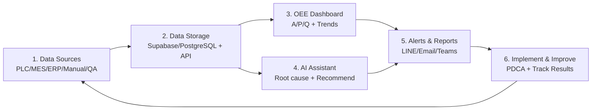

# OEE Digital Platform — Proposal Outline, User Stories & AI Coding Guide

เอกสารนี้แปลงจากเวิร์กโฟลว์ **OEE Dashboard + AI Assistant** (6 ขั้น: แหล่งข้อมูล → จัดเก็บ → Dashboard → AI → แจ้งเตือน → ปรับปรุง) ให้ใช้เป็น proposal / backlog / build guide สำหรับที่ปรึกษาและทีมพัฒนา

---

## 1) Proposal Outline (โครงข้อเสนอโครงการ)

### 1.1 Executive Summary
สร้าง **OEE Digital Platform** ที่ปิดวงจร  
**เก็บข้อมูลจริง → คำนวณ OEE → แสดง Dashboard → AI วิเคราะห์สาเหตุ → แจ้งเตือนผู้เกี่ยวข้อง → ลงมือปรับปรุงและวัดผลซ้ำ**

ไม่ใช่แค่หน้าจอ KPI แต่เป็นระบบช่วยตัดสินใจและ Continuous Improvement ของโรงงาน

### 1.2 Business Objectives
| เป้า | ตัวชี้วัดตัวอย่าง |
|---|---|
| เห็นสถานะผลิตแบบ real-time | latency ข้อมูล ≤ 1–5 นาที (ตามแหล่งข้อมูล) |
| ลด downtime ที่ป้องกันได้ | Top downtime ลดลง X% ใน 90 วัน |
| เพิ่ม OEE | +3 ถึง +8 จุด (ขึ้นกับ baseline) |
| ตัดสินใจเร็วขึ้น | เวลาจาก “พบปัญหา” → “มี action owner” ลดลง |
| Single Source of Truth | ทุกบทบาทดูตัวเลขชุดเดียวกัน |

### 1.3 Scope (In / Out)

**In Scope**
1. Data ingestion จาก PLC/เครื่องจักร, ERP/MES, downtime manual, QA
2. Data platform (แนะนำ Supabase/PostgreSQL หรือเทียบเท่า)
3. OEE calculation engine (Availability / Performance / Quality)
4. Role-based Dashboard (Operator → Executive)
5. AI Assistant สำหรับถาม-ตอบเชิงวิเคราะห์ OEE
6. Automated alerts & reports (LINE OA / Email / Microsoft Teams)
7. Improvement action tracking (Plan → Do → Check → Act)

**Out of Scope (เฟสแรก — ระบุชัดใน proposal)**
- Full CMMS ทดแทนระบบบำรุงรักษาเดิมทั้งหมด
- Advanced digital twin / simulation
- AI ควบคุมเครื่องจักรอัตโนมัติ (closed-loop control)
- Mobile native app (ใช้ responsive web ก่อนได้)

### 1.4 Solution Architecture (6 Layers ตามภาพ)

### 1.5 Stakeholders & Roles
Operator, Supervisor, Maintenance, QA, Plant Manager, Executive, IT/OT Admin, Continuous Improvement (CI) Lead

### 1.6 Success Criteria (Acceptance ระดับโครงการ)
- คำนวณ OEE ได้ถูกต้องตามนิยามที่ลงนามร่วมกัน
- Dashboard ใช้งานได้จริงบน floor และในห้องประชุม
- AI ตอบคำถามหลักได้พร้อมอ้างอิงข้อมูลโรงงาน (ไม่ใช่คำตอบทั่วไป)
- มีรายงาน Daily OEE / Top 3 Downtime ส่งอัตโนมัติ
- มี action จาก insight อย่างน้อย 1 วงจร PDCA ที่วัดผลได้

### 1.7 Commercial Options (ตัวอย่างโครงราคาใน proposal)
- **Pilot (1 สายการผลิต / 4–8 สัปดาห์):** Phase 1
- **Plant Rollout:** Phase 1–2 หลายไลน์
- **AI Advisory Pack:** Phase 3 + change management

---

## 2) User Stories ตามบทบาท

รูปแบบ: `As a … I want … so that …` + Acceptance Criteria สั้น ๆ

### 2.1 Operator (พนักงานเดินเครื่อง)
| ID | User Story | Acceptance Criteria |
|---|---|---|
| US-OP-01 | ต้องการเห็น OEE/สถานะเครื่องของกะปัจจุบันแบบง่าย | แสดง A/P/Q และสถานะ Running/Down ภายใน 1 หน้าจอ |
| US-OP-02 | ต้องการลงเหตุผล downtime เร็ว ๆ บนแท็บเล็ต/มือถือ | เลือกเหตุผลจากรายการมาตรฐานได้ใน ≤ 30 วินาที |
| US-OP-03 | ต้องการรู้ว่าตอนนี้ผลิตช้าหรือของเสียพุ่ง | มีสี/สถานะชัดเจนเมื่อ Performance หรือ Quality ต่ำกว่าเกณฑ์ |

### 2.2 Supervisor (หัวหน้ากะ/หัวหน้าไลน์)
| ID | User Story | Acceptance Criteria |
|---|---|---|
| US-SV-01 | ต้องการสรุป OEE รายกะและเทียบเป้า | มีสรุปกะ + gap ต่อเป้า + Top downtime |
| US-SV-02 | ต้องการรู้ว่าทำไม OEE ตกวันนี้ | ถาม AI หรือเปิดหน้า Root Cause Summary ได้ |
| US-SV-03 | ต้องการมอบหมายงานแก้ปัญหาให้ Maintenance/QA | สร้าง action จาก downtime/defect ได้และมี owner/due date |
| US-SV-04 | ต้องการรับแจ้งเตือนเมื่อ OEE ต่ำผิดปกติ | ได้ LINE/Teams เมื่อต่ำกว่า threshold ที่ตั้งไว้ |

### 2.3 Maintenance (ซ่อมบำรุง)
| ID | User Story | Acceptance Criteria |
|---|---|---|
| US-MT-01 | ต้องการดูเครื่องที่ breakdown บ่อยและ MTTR/MTBF | มี ranking เครื่อง + ระยะเวลาหยุด + ประวัติซ่อม |
| US-MT-02 | ต้องการแจ้งเตือนเมื่อมี breakdown/alarm สำคัญ | push ทันทีพร้อมเครื่อง/ไลน์/เวลาเริ่ม |
| US-MT-03 | ต้องการให้ AI แนะนำจุดที่ควรทำ Planned Maintenance ก่อน | AI อ้างประวัติ downtime/alarm ได้ และเรียงลำดับความเร่งด่วน |
| US-MT-04 | ต้องการปิดงานแล้วเห็นผลต่อ Availability | หลังปิดงาน ตัวเลข Availability/OEE ของช่วงนั้นอัปเดตได้ |

### 2.4 QA (คุณภาพ)
| ID | User Story | Acceptance Criteria |
|---|---|---|
| US-QA-01 | ต้องการเชื่อม defect/rework เข้า Quality ของ OEE | Quality คำนวณจาก good / total ตามนิยามที่ตกลง |
| US-QA-02 | ต้องการเห็นแนวโน้ม reject/rework รายเครื่อง/รายกะ | มี chart และ filter ตามเครื่อง/ผลิตภัณฑ์ |
| US-QA-03 | ต้องการให้ AI หาความสัมพันธ์ downtime กับของเสีย | คำตอบมี evidence จากข้อมูลจริงของช่วงเวลาที่ถาม |

### 2.5 Plant Manager
| ID | User Story | Acceptance Criteria |
|---|---|---|
| US-PM-01 | ต้องการภาพรวม OEE ทั้งโรงงานรายวัน/รายสัปดาห์ | plant rollup + drill-down ลงไลน์/เครื่องได้ |
| US-PM-02 | ต้องการ Top 3 losses และข้อเสนอปรับปรุง | รายงานอัตโนมัติมี losses + suggested actions |
| US-PM-03 | ต้องการติดตามว่า action ปรับปรุงเดินไปถึงไหน | มีสถานะ Open/In Progress/Done และผลก่อน-หลัง |

### 2.6 Executive
| ID | User Story | Acceptance Criteria |
|---|---|---|
| US-EX-01 | ต้องการสรุปผลผลิต/ประสิทธิภาพแบบไม่ต้องลงรายละเอียดเทคนิค | 1-page exec view: OEE, downtime cost proxy, trend |
| US-EX-02 | ต้องการรายงานอัตโนมัติรายวัน/รายสัปดาห์ทาง Email | ส่งตามตาราง พร้อมลิงก์เข้า dashboard |
| US-EX-03 | ต้องการมั่นใจว่าตัวเลขเป็นชุดเดียวกับหน้างาน | ใช้แหล่งข้อมูลเดียวกับ operational dashboard |

### 2.7 IT/OT Admin
| ID | User Story | Acceptance Criteria |
|---|---|---|
| US-IT-01 | ต้องการจัดการแหล่งข้อมูลและการเชื่อมต่อ API/PLC gateway | มี admin console ดู connection health |
| US-IT-02 | ต้องการควบคุมสิทธิ์ตามบทบาท | RBAC แยก view/edit ตาม role |
| US-IT-03 | ต้องการ audit log การแก้ master data และ threshold | เก็บ who/when/what ได้ |

### 2.8 CI / TPM Lead (Continuous Improvement)
| ID | User Story | Acceptance Criteria |
|---|---|---|
| US-CI-01 | ต้องการใช้ข้อมูล OEE ขับ PDCA/TPM loss analysis | export หรือสร้าง improvement case จาก Top losses |
| US-CI-02 | ต้องการถาม AI ว่าควรโฟกัส loss ไหนก่อน | ได้ prioritized recommendation พร้อมเหตุผลและข้อมูลอ้างอิง |
| US-CI-03 | ต้องการวัดผลก่อน-หลังโครงการปรับปรุง | เปรียบเทียบ OEE/A/P/Q ช่วง baseline กับหลังทำได้ |

### 2.9 ตัวอย่าง AI Questions ที่ต้องรองรับ (จากภาพ)
1. ทำไม OEE วันนี้ลดลง?
2. เครื่องไหนพังบ่อยที่สุด?
3. ต้องผลิตเท่าไหร่ถึงจะถึง OEE 85%?
4. ควรปรับปรุงอะไรก่อนเป็นอันดับแรก?

---

## 3) Roadmap 3 เฟส + Deliverables

### Phase 1 — Foundation: Data + OEE + Dashboard
**เป้าหมาย:** ตัวเลขถูกต้อง มองเห็นจริง ใช้งานบนไลน์ได้  
**ครอบคลุมขั้นภาพ:** 1–3

| Workstream | Deliverable |
|---|---|
| OEE Definition Workshop | เอกสารนิยาม OEE, planned stop, ideal cycle time, quality rule (ลงนาม) |
| Data Connectors (MVP) | Ingestion จากอย่างน้อย 1 ไลน์: PLC/MES และ/หรือ manual downtime + QA |
| Data Model & Storage | Schema PostgreSQL/Supabase: machines, shifts, production counts, downtime, defects, oee_snapshots |
| OEE Engine | คำนวณ Availability / Performance / Quality / OEE รายเครื่อง-รายกะ |
| Operational Dashboard | KPI cards, OEE trend, downtime minutes, reject/rework |
| Access Control | Login + role พื้นฐาน (Operator/Supervisor/Manager) |
| Pilot Validation | เทียบตัวเลขกับ Excel/ระบบเดิม ≥ ช่วง 2 สัปดาห์ |

**Exit Criteria Phase 1**
- OEE รายกะตรงกับที่ทีมยืนยัน (variance ในเกณฑ์ที่ตกลง เช่น ±1–2 จุด)
- Supervisor ใช้ dashboard ใน daily meeting ได้จริง

---

### Phase 2 — Automation: Alerts + Reports + Action Loop
**เป้าหมาย:** ข้อมูลวิ่งหาคน และเริ่มปิดวงจรปรับปรุง  
**ครอบคลุมขั้นภาพ:** 5 + บางส่วนของ 6

| Workstream | Deliverable |
|---|---|
| Alert Rules Engine | threshold OEE/downtime/quality + escalation |
| Channel Integration | LINE OA, Email, Microsoft Teams |
| Scheduled Reports | Daily OEE summary, Top 3 Downtime, weekly plant digest |
| Action Tracker | สร้าง/มอบหมาย/ปิดงานปรับปรุง ผูกกับ loss ที่พบ |
| Supervisor Cockpit | มุมมองกะ + alerts + open actions |
| Data Quality Monitor | แจ้งเมื่อข้อมูลขาด/ช้า/ผิดปกติ |

**Exit Criteria Phase 2**
- รายงาน Daily ส่งอัตโนมัติถึงผู้รับที่กำหนด
- มี action จาก Top downtime อย่างน้อย N รายการต่อสัปดาห์ และติดตามสถานะได้

---

### Phase 3 — Intelligence: AI Assistant + Advisory PDCA
**เป้าหมาย:** จาก “ดูกราฟ” เป็น “ถามแล้วได้คำแนะนำที่อิงข้อมูลจริง”  
**ครอบคลุมขั้นภาพ:** 4 + 6 แบบเต็ม

| Workstream | Deliverable |
|---|---|
| Analytics Feature Store | มุมมองพร้อมใช้สำหรับ AI: downtime Pareto, machine ranking, OEE drivers |
| Knowledge Base (RAG) | SOP, standard downtime codes, past improvement cases |
| AI Assistant (Agentic RAG) | ตอบคำถามหลัก 4 ข้อ + follow-up พร้อม citation |
| Validation Layer | ตรวจว่าตัวเลขในคำตอบตรง query ข้อมูลจริง |
| Predictive / Early Warning (optional) | แจ้งแนวโน้มผิดปกติก่อน OEE พัง |
| CI Workspace | บันทึก PDCA case, ก่อน-หลัง, yokoten |
| Change Management | คู่มือใช้งาน, training ตามบทบาท, office-hour ช่วง go-live |

**Exit Criteria Phase 3**
- AI ตอบคำถาม golden set (≥ 20 คำถาม) ผ่านเกณฑ์ความถูกต้องที่ตกลง
- มีอย่างน้อย 1 improvement cycle ที่เริ่มจาก AI insight และวัดผล OEE ได้

---

### Timeline เชิงเทคนิค (ไม่ใช่ปฏิทินขาย)
| เฟส | ขอบเขตงานหลัก | ความเสี่ยงหลัก |
|---|---|---|
| Phase 1 | OT connectivity, นิยาม OEE, dashboard | ข้อมูลไม่ครบ/นิยามไม่ชัด |
| Phase 2 | notification, action workflow | alert fatigue, adoption |
| Phase 3 | RAG/agent, validation, PDCA linkage | hallucination, data gaps |

---

## 4) แนะนำ AI Coding สร้าง Platform แต่ละ Layer

แนวทาง: ใช้ AI coding agent (Cursor / Copilot ฯลฯ) เป็น **คู่พัฒนา** โดยให้คนกำหนด contract, นิยาม OEE, และ acceptance — AI ช่วย gen boilerplate, tests, connectors, UI

### Layer 1 — Data Sources (Ingestion)
**สร้างอะไร**
- Collectors/connectors: PLC gateway (OPC UA/Modbus), MES/ERP API, manual downtime form API, QA import
- Canonical event schema: `production_count`, `downtime_event`, `defect_event`, `energy_event` (ถ้ามี)

**ให้ AI coding ช่วย**
- สร้าง TypeScript/Python client จาก OpenAPI ของ MES/ERP
- Gen JSON Schema / Zod / Pydantic ของ event
- เขียน unit tests สำหรับ mapping รหัสเครื่อง/กะ
- สร้าง idempotent ingest jobs (upsert by event_id)

**Prompt pattern ที่ได้ผล**
> “Generate an idempotent ingest worker that upserts downtime_events into Postgres. Include retry, dead-letter, and schema validation with Zod. Do not invent PLC protocols—stub the adapter interface.”

**อย่าให้ AI เดาเอง**
- จริงของ PLC address, tag list, และ business meaning ของ signal

---

### Layer 2 — Data Storage (Supabase / PostgreSQL)
**สร้างอะไร**
- Tables: `plants`, `lines`, `machines`, `shifts`, `production_records`, `downtime_events`, `defect_records`, `oee_results`, `alert_rules`, `actions`, `users_roles`
- RLS/RBAC, views สำหรับ dashboard, materialized views สำหรับ aggregate รายกะ
- Realtime publication (ถ้าใช้ Supabase)

**ให้ AI coding ช่วย**
- Gen migration SQL จาก ERD
- Gen Supabase RLS policies ตาม role matrix
- Gen seed data สำหรับ demo 1 ไลน์
- Gen repository/DAO + integration tests

**แนะนำ stack**
- PostgreSQL + Supabase (auth, realtime, storage) หรือ Postgres + NestJS/FastAPI
- Prisma/Drizzle หรือ SQL migrations ตรง ๆ

**Definition of Done**
- มี migration ย้อนกลับได้ + seed + ทดสอบคำนวณ OEE จาก fixture

---

### Layer 3 — Dashboard Display
**สร้างอะไร**
- Web app: KPI cards (OEE/A/P/Q), trend, downtime bar, reject/rework
- Filter: โรงงาน/ไลน์/เครื่อง/กะ/ช่วงวันที่
- Responsive สำหรับแผงผลิตและห้องประชุม

**ให้ AI coding ช่วย**
- Gen Next.js/React pages จาก wireframe
- Gen chart components (Recharts/ECharts) จาก API contract
- Gen Storybook/visual states: loading, empty, threshold breach
- Gen Playwright smoke tests ต่อ role

**UX rule สำหรับโรงงาน**
- ตัวเลขใหญ่ อ่านไกลได้
- สีสถานะชัด (ไม่พึ่งข้อความยาว)
- หลีกเลี่ยง dashboard รกหลายการ์ดใน hero ของหน้าหลักไลน์

**Prompt pattern**
> “Build an OEE line dashboard with 4 KPI tiles and 2 charts. Use existing `/api/oee/summary` response types. Mobile-first, high-contrast, no decorative cards.”

---

### Layer 4 — AI Assistant (วิเคราะห์ข้อมูล)
**สร้างอะไร**
- Chat API ที่ตอบจากข้อมูลโรงงาน
- Tool calling: `get_oee`, `get_top_downtime`, `get_machine_ranking`, `estimate_output_for_target_oee`
- RAG บน SOP/downtime dictionary/improvement history
- Answer validation: ตัวเลขในคำตอบต้องตรง query

**สถาปัตยกรรมที่แนะนำ (เชื่อมกับแนว Agentic RAG)**
1. Orchestrator แตกคำถาม
2. เลือก tools (SQL/API ไม่ใช่เดาตัวเลข)
3. ประกอบ context + citations
4. Generate
5. Validate/Reflect ก่อนตอบ

**ให้ AI coding ช่วย**
- Gen tool schemas และ function-calling handlers
- Gen SQL templates ปลอดภัย (parameterized) สำหรับคำถามบ่อย
- Gen evaluation set (golden Q&A) + automated scoring harness
- Gen UI chat ที่โชว์ citation และ “ข้อมูล ณ เวลา…”

**อย่าทำ**
- ให้ LLM คิด OEE จากความจำ
- ตอบโดยไม่มีแหล่งข้อมูลอ้างอิงเมื่อเป็นตัวเลข

**Prompt pattern**
> “Implement an agent tool `get_top_downtime(line_id, from, to, limit)` that queries Postgres and returns structured JSON. Add a validator that fails the answer if cited minutes ≠ query sum.”

---

### Layer 5 — Notifications & Reports
**สร้างอะไร**
- Scheduler (cron/queue): daily summary, Top 3 downtime, threshold alerts
- Adapters: LINE Messaging API, SMTP/Email, Microsoft Teams webhook
- Template รายงานภาษาไทย/อังกฤษ + deep link เข้า dashboard

**ให้ AI coding ช่วย**
- Gen job definitions + retry/backoff
- Gen message templates จาก sample payload
- Gen unsubscribe/quiet hours logic
- Gen tests ด้วย mock providers

**กัน Alert Fatigue**
- รวม alert ซ้ำในหน้าต่างเวลา
- ส่งเฉพาะเมื่อ cross threshold หรือ severity สูง
- แยก audience ตามบทบาท

---

### Layer 6 — Implementation & Improvement (PDCA)
**สร้างอะไร**
- Action module: problem → root cause → plan → owner → due date → result
- เชื่อม action กับ downtime code / machine / period
- หน้าเปรียบเทียบก่อน-หลัง (OEE/A/P/Q)

**ให้ AI coding ช่วย**
- Gen CRUD + state machine (`open → doing → verify → closed`)
- Gen “create action from AI recommendation” flow
- Gen before/after report API
- Gen export ให้ CI/TPM meeting

**นิยามความสำเร็จของ layer นี้**
- Insight จากระบบต้องแปลงเป็นงานที่มี owner ได้ในคลิกเดียว

---

## 5) แนะนำวิธีใช้ AI Coding แบบทั้งโครงการ (Operating Model)

### 5.1 ลำดับงานที่ควรให้ AI ช่วยก่อน
1. Data model + migrations + OEE formula tests  
2. API contracts + fake data  
3. Dashboard UI บน fake data  
4. Connectors จริงทีละแหล่ง  
5. Alerts  
6. AI tools + RAG + eval harness  

### 5.2 Guardrails สำหรับทีมที่ปรึกษา
| หัวข้อ | แนวปฏิบัติ |
|---|---|
| Source of truth | ตัวเลข OEE มาจาก engine ใน DB เท่านั้น |
| Secrets | ไม่ให้ AI commit key; ใช้ env/secret manager |
| OT safety | connector อ่านอย่างเดียวในเฟสแรก |
| Traceability | ทุกคำตอบ AI เก็บ tool traces + query ids |
| Definition lock | ล็อกสูตร OEE ก่อนเขียน UI/AI |

### 5.3 Definition of Ready สำหรับแต่ละ ticket
- มี persona + acceptance
- มี API/schema หรือลิงก์ Figma/wireframe
- มีตัวอย่างข้อมูลจริงหรือ synthetic
- มีขอบเขต “ห้ามเดา” (โดยเฉพาะ OT tags และสูตร)

### 5.4 Tech Stack แนะนำ (ปรับตามลูกค้าได้)
| Layer | แนะนำ |
|---|---|
| Frontend | Next.js + TypeScript |
| Backend | NestJS หรือ FastAPI |
| DB | PostgreSQL / Supabase |
| Queue | Supabase Edge + cron, หรือ Redis/BullMQ |
| AI | LLM + tool calling + pgvector/Supabase Vector |
| Observability | OpenTelemetry + app logs + AI cost/latency log |

---

## 6) แพ็กเกจส่งมอบที่ใส่ใน Proposal ได้ทันที

1. **Architecture & OEE Rulebook**  
2. **Backlog User Stories ตามบทบาท (เอกสารนี้)**  
3. **Phase Plan + Deliverables + Exit Criteria**  
4. **Demo Dashboard (1 ไลน์)**  
5. **AI Assistant Pilot (golden questions)**  
6. **Training & Runbook รายบทบาท**  
7. **ROI baseline vs after 90 days**

---

## 7) One-line Pitch สำหรับลูกค้า

**OEE Digital Platform = ข้อมูลจริงบนไลน์ + Dashboard ที่ทุกคนเชื่อตัวเลขเดียวกัน + AI ที่ชี้ว่าควรแก้อะไรก่อน + ระบบมอบหมายงานจนวัดผลได้**

> Good Data + Smart AI = โรงงานที่แข็งแรงและยั่งยืน
