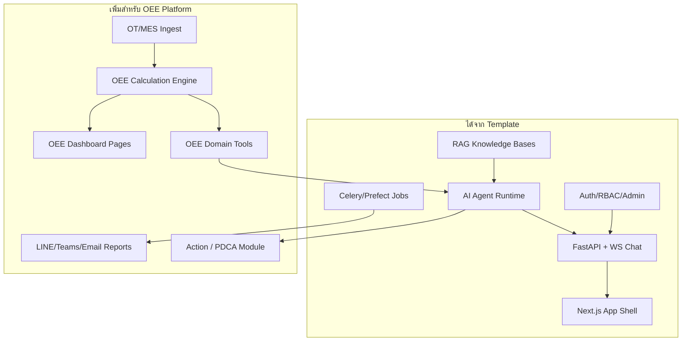

# ใช้ Full-Stack AI Agent Template สร้าง OEE Digital Platform

อ้างอิง: [vstorm-co/full-stack-ai-agent-template](https://github.com/vstorm-co/full-stack-ai-agent-template)  
เชื่อมกับ: `OEE_Digital_Platform_Proposal_Outline.md`

---

## 1) Template นี้คืออะไร (สรุปโครงสร้าง)

เป็น **project generator** (`fastapi-fullstack`) ที่สร้างแอป production-ready:

| ส่วน | เทคโนโลยีหลัก |
|---|---|
| Backend | FastAPI, SQLAlchemy 2.0, Alembic, PostgreSQL |
| Frontend | Next.js 15, WebSocket chat UI, dashboard/admin |
| AI Agents | PydanticAI / PydanticDeep / LangChain / LangGraph / DeepAgents |
| RAG | Milvus / Qdrant / ChromaDB / **pgvector** |
| Jobs | Celery / Taskiq / ARQ / Prefect + Redis |
| Auth | JWT, OAuth, roles, admin panel |
| Channels | Telegram, Slack (pattern ขยายไป LINE/Teams ได้) |
| Ops | Docker, K8s, Logfire/LangSmith, health checks |

### Generated layout ที่สำคัญ
```
backend/app/
  agents/          # assistant + tools (RAG, chart, code, web, ask_user)
  api/routes/      # REST + WebSocket
  services/        # rag, channels, email, billing...
  worker/tasks/    # background / scheduled jobs
  db/models/       # SQLAlchemy models
  repositories/    # data access
frontend/src/
  components/chat|dashboard|kb|admin|...
  hooks/           # useChat, useWebSocket
.claude/skills/    # agent-tool, rag-knowledge, background-task, ...
```

จุดแข็งสำหรับ OEE: **มีครบชั้น Auth → DB → Agent+Tools → RAG → Streaming Chat → Jobs → Admin**  
สิ่งที่ template **ไม่มี** และต้องเพิ่มเอง: **โดเมน OEE** (สูตร A/P/Q, PLC/MES ingest, downtime taxonomy, plant hierarchy)

---

## 2) แมป Template → OEE 6 Layers

| OEE Layer (จากภาพ) | ใช้ของ Template | ต้องสร้างเพิ่ม (OEE-specific) |
|---|---|---|
| **1. Data Sources** | worker/tasks, repositories, API upload, sync sources | PLC/OPC-UA/Modbus adapters, MES/ERP connectors, manual downtime API, QA import |
| **2. Data Storage** | PostgreSQL + Alembic + (แนะนำ **pgvector**) | tables: plants/lines/machines/shifts/production/downtime/defects/`oee_results` |
| **3. Dashboard** | Next.js dashboard shell, charts in chat | OEE KPI pages (A/P/Q), trend, Pareto downtime, role views |
| **4. AI Assistant** | Agent + WebSocket stream + tool cards + RAG KB | OEE tools: `get_oee`, `get_top_downtime`, `rank_machines`, `estimate_target_oee` + validate |
| **5. Alerts & Reports** | Celery/Prefect schedules, email, channel bots | Daily OEE / Top3 downtime jobs, LINE OA + Teams adapters, thresholds |
| **6. PDCA Improve** | (ไม่มีโดเมนนี้) | Action tracker state machine + link จาก AI recommendation |



---

## 3) แนะนำค่า Config ตอน Generate (สำหรับ OEE)

```bash
# แนวทางที่เหมาะกับโรงงาน / internal platform
fastapi-fullstack create oee_digital_platform \
  --database postgresql \
  --rag \
  # เลือก vector store = pgvector (ใช้ Postgres ชุดเดียว ไม่ต้องตั้ง Milvus แยกในเฟสแรก)
  # AI framework แนะนำ: pydantic-ai หรือ langgraph (tool calling ชัด)
  # task queue: celery หรือ prefect (รายงานรายวัน/ingest)
```

| ตัวเลือก | แนะนำสำหรับ OEE | เหตุผล |
|---|---|---|
| Database | PostgreSQL | single source of truth + analytics SQL |
| Vector store | **pgvector** | SOP/downtime dictionary อยู่กับข้อมูลผลิต |
| AI framework | **PydanticAI** หรือ **LangGraph** | typed tools / multi-step reason เหมาะ Agentic RAG |
| Task queue | **Celery** หรือ **Prefect** | daily report, ingest, alert |
| Auth | JWT + roles (ปิด SaaS billing ได้ถ้า internal) | Operator→Exec RBAC |
| Channels | เริ่ม Email + ขยาย LINE/Teams | ภาพ OEE ระบุ LINE OA / Email / Teams |
| Frontend | Next.js | dashboard + AI chat ในแอปเดียว |
| Observability | Logfire หรือ LangSmith | audit คำตอบ AI / latency / cost |

**ปิด/เลื่อนได้ในเฟสแรก:** Stripe billing, marketing site, multi-tenant SaaS ซับซ้อน — โฟกัส plant ops ก่อน

---

## 4) แผนปรับปรุงโค้ด: เอา Template มาทำ OEE อย่างไร

### Phase A — Scaffold จาก Template (1–2 วันทำงาน)
1. Generate โปรเจกต์ด้วย preset ใกล้ `ai-agent` / production (ตัด billing ถ้าไม่ต้อง)
2. `make bootstrap` ให้ API + Postgres + admin พร้อม
3. ยืนยัน: login, chat streaming, RAG upload, health admin ใช้งานได้
4. ตั้ง repo แยก `oee-digital-platform` (หรือ monorepo) — **อย่าผสมกับ OPL Analyzer โดยตรงถ้าโดเมนต่างกัน**

### Phase B — Domain Core (เทียบ Phase 1 ของ proposal)
เพิ่มใน `backend/app/`:

```
db/models/oee_*.py          # plant, line, machine, shift, events, oee_results
services/oee_engine.py      # คำนวณ A/P/Q/OEE ตาม rulebook
services/ingest/            # adapters + canonical events
api/routes/oee.py           # /oee/summary, /downtime/top, /machines/ranking
repositories/oee_*.py
```

Frontend:
```
components/oee/             # KPI tiles, trend, downtime bars
app/.../oee/dashboard       # หน้าหลักไลน์/โรงงาน
```

**กฎสำคัญ:** ตัวเลข OEE มาจาก `oee_engine` ใน DB เท่านั้น — Agent ห้ามคิดตัวเลขเอง

### Phase C — AI Tools บนโครง Template (เทียบ Phase 3 แต่เตรียมสัญญาตั้งแต่เฟส 1)
ใช้ skill/pattern ของ template: `.claude/skills/agent-tool`

สร้าง tools ใหม่ใน `backend/app/agents/tools/`:

| Tool | หน้าที่ | ใช้ตอบคำถาม |
|---|---|---|
| `get_oee_summary` | OEE/A/P/Q ตาม line/shift/date | ทำไม OEE ตก / สถานะวันนี้ |
| `get_top_downtime` | Pareto เหตุผล downtime | Top losses |
| `rank_machines_by_breakdown` | เรียงเครื่องพังบ่อย | เครื่องไหนพังบ่อย |
| `estimate_output_for_target_oee` | คำนวณ output ที่ต้องถึงเป้า | ต้องผลิตเท่าไรถึง 85% |
| `search_knowledge_base` | มีใน template แล้ว | SOP / downtime codes |
| `create_chart` | มีใน template แล้ว | โชว์แนวโน้มในแชท |
| `create_improvement_action` | ใหม่ | สร้างงาน PDCA จากคำแนะนำ |

เพิ่มใน `prompts.py`:
- บังคับเรียก tools ก่อนตอบตัวเลข
- ระบุ mill/line/shift เมื่อกำกวม → ใช้ `ask_user`
- ทุกตัวเลขต้องมีช่วงเวลา + citation จาก tool result

เพิ่ม **validator** หลัง generate (ยังไม่มีใน template สำเร็จรูป):
- ตรวจว่านาที downtime ที่พูด = sum จาก `get_top_downtime`
- ถ้าไม่ตรง → refine หรือปฏิเสธคำตอบ

### Phase D — Jobs & Channels (เทียบ Phase 2)
ใช้ `worker/tasks` + `services/channels`:

| Job | Schedule | Channel |
|---|---|---|
| Daily OEE summary | ทุกสิ้นวัน/สิ้นกะ | Email / LINE / Teams |
| Top 3 Downtime | รายวัน | Supervisor + Maintenance |
| Threshold breach | near-realtime | push เมื่อ OEE/quality ต่ำ |
| Ingest poll MES | ทุก 1–5 นาที | internal |

ขยาย channel pattern จาก `telegram.py` / `slack.py` → `line_oa.py`, `teams.py`

### Phase E — PDCA Module
ยังไม่มีใน template → เพิ่มโมดูลใหม่:
- models: `improvement_actions` (open→doing→verify→closed)
- API + UI board
- tool `create_improvement_action` ให้ Agent สร้างงานได้ในคลิก/คำสั่งเดียว

---

## 5) โครงสร้างโฟลเดอร์เป้าหมาย (หลัง customize)

```
oee_digital_platform/
├── backend/app/
│   ├── agents/
│   │   ├── assistant.py              # ใช้ของ template
│   │   ├── prompts.py                # OEE system prompt
│   │   └── tools/
│   │       ├── rag_tool.py           # keep
│   │       ├── chart_tool.py         # keep
│   │       ├── oee_tools.py          # NEW
│   │       └── action_tools.py       # NEW
│   ├── services/
│   │   ├── oee_engine.py             # NEW
│   │   ├── ingest/                   # NEW
│   │   ├── rag/                      # keep
│   │   └── channels/                 # extend LINE/Teams
│   ├── worker/tasks/
│   │   ├── oee_report_tasks.py       # NEW
│   │   ├── ingest_tasks.py           # NEW
│   │   └── rag_tasks.py              # keep
│   └── api/routes/
│       ├── oee.py                    # NEW
│       └── ...                       # auth/chat/kb จาก template
└── frontend/src/
    ├── components/oee/               # NEW dashboards
    ├── components/chat/              # keep + OEE tool cards
    └── components/kb/                # SOP library
```

---

## 6) วิธีใช้ AI Coding กับ Template นี้ให้เร็วขึ้น

Template มี `.claude/skills/` ที่ตรงงาน OEE มาก:

| Skill ของ Template | ใช้ทำอะไรใน OEE |
|---|---|
| `agent-tool` | เพิ่ม `get_oee_summary` ฯลฯ |
| `rag-knowledge` | ingest SOP / downtime dictionary / past Kaizen |
| `background-task` | daily report + ingest poll |
| `alembic-migration` | schema machines/events/oee_results |
| `frontend-feature` | หน้า OEE dashboard / action board |
| `pytest-suite` | ทดสอบสูตร OEE + tool contracts |
| `channel-bot` | แบบอย่างส่งข้อความออกนอกเว็บ |

**ลำดับให้ AI coding ทำ (อย่ากระโดดทำ chat ก่อนสูตร):**
1. migrations + `oee_engine` + fixture tests  
2. REST `/api/oee/*`  
3. Dashboard UI บน API จริง  
4. Agent tools ที่เรียก API/SQL เดียวกัน  
5. Report jobs + channels  
6. RAG SOP + validation harness (golden 20 คำถาม)

---

## 7) สิ่งที่ควรยืม / ไม่ควรยืม

### ยืมได้เลย
- FastAPI layered architecture (api → services → repositories → db)
- WebSocket agent streaming + tool result cards
- RAG knowledge base UI/upload/sync
- Auth/RBAC/admin/health
- Celery/Prefect scheduling
- Chart tool ในแชท (อธิบาย OEE trend ให้ Supervisor)
- Docker/Make bootstrap workflow

### อย่ายืมมาง่าย ๆ โดยไม่ปรับ
- **Billing/credits SaaS** — มักไม่จำเป็นในโรงงาน on-prem/internal
- **Marketing site** — ไม่ใช่แกน OEE
- ให้ Agent ใช้แค่ `web_search` / `run_python` ตอบ OEE โดยไม่มี domain tools
- Vector DB แยกใหญ่เกินจำเป็นในเฟส pilot (เริ่ม pgvector พอ)

### ต้องสร้างเองเสมอ
- นิยาม OEE ที่ลงนามกับลูกค้า
- Plant hierarchy + downtime codes ภาษาไทย/โรงงาน
- OT read-only safety ของ connector
- Answer validation กันตัวเลขหลอน

---

## 8) ตัวอย่าง Flow ที่ได้หลังรวม Template + OEE

**คำถาม:** “ทำไม OEE ไลน์ Packing-2 วันนี้ตก?”

1. Chat UI (template) ส่งข้อความผ่าน WebSocket  
2. Agent (template) วางแผน → เรียก `get_oee_summary` + `get_top_downtime` (ของเรา)  
3. เรียก `search_knowledge_base` ถ้าเกี่ยวกับ SOP  
4. `create_chart` แสดง downtime breakdown ในแชท  
5. Validator ตรวจตัวเลข  
6. ตอบพร้อม citation + ปุ่ม/ tool สร้าง improvement action  
7. (ตาม schedule) job ส่งสรุป Top 3 ไป LINE/Teams  

นี่คือ **Agentic RAG บนข้อมูลโรงงาน** ตาม blueprint ก่อนหน้า — โดยใช้ runtime จาก template เป็นฐาน

---

## 9) Recommendation สั้น ๆ สำหรับทีมที่ปรึกษา

1. **ใช้ template เป็น skeleton** ของ Web + AI + Jobs — อย่าเริ่มจากศูนย์  
2. **ใส่โดเมน OEE เป็นหัวใจ** (engine + ingest + dashboards) ก่อนทำ AI สวย  
3. **AI = tools บนข้อมูลจริง** ไม่ใช่ chatbot อ่านเอกสารอย่างเดียว  
4. **Roadmap เดิม 3 เฟสยังใช้ได้** — template เร่ง Phase 3 (AI chat/RAG/jobs) ให้เริ่มเร็วขึ้นมาก  
5. Generate ครั้งแรกเลือก **Postgres + pgvector + PydanticAI/LangGraph + Celery/Prefect + Next.js**

---

## 10) Next actions ที่ทำต่อได้ทันที

1. Generate `oee_digital_platform` จาก template ด้วย config ด้านบน  
2. เขียน OEE rulebook → migrations → `oee_engine` tests  
3. เพิ่ม 4 OEE tools + golden question eval  
4. สร้างหน้า Dashboard A/P/Q  
5. ต่อ Daily report job + LINE/Email  

### สถานะใน repo นี้ (อัปเดตแล้ว)
Scaffold จริงอยู่ที่ `oee_digital_platform/` พร้อม:
- `backend/sql/oee_schema.sql` + `oee_seed_demo.sql`
- `backend/app/services/oee_engine.py`
- `backend/app/agents/tools/oee_tools.py` (wired ใน assistant)
- `backend/app/oee_layers/` — Harness + Loop + Graph
- `POST /api/v1/oee/workflows/run`
- Alembic `0028_create_oee_tables`
- ดูรายละเอียดใน `oee_digital_platform/OEE_DOMAIN.md`
