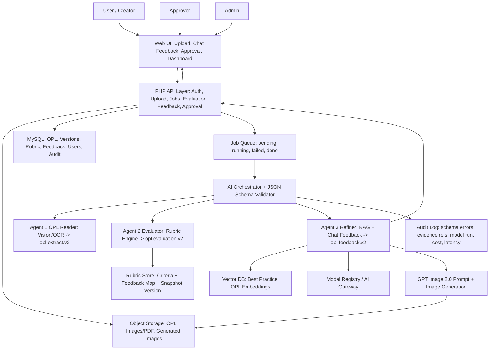

# OPL AI Feedback System — Vibe Coding Blueprint v2

## Executive Summary
เป้าหมายคือเปลี่ยนไฟล์ skill 3 agent ให้เป็น contract ที่ coder/AI coding agent นำไปสร้าง Web Application ได้ทันที
โดยแก้ 5 จุดหลัก: schema, validation, criterion key, async workflow, และ audit trail

## จุดอ่อนของระบบเดิม
| Area | จุดอ่อน | ผลกระทบ | สิ่งที่ปรับใน v2 |
|---|---|---|---|
| Agent 1 | JSON ยังไม่บังคับ provenance ราย field, ไม่มี bbox/page/quality | Agent 2 ให้คะแนน S3/S4 แบบไม่แน่น | เพิ่ม `opl.extract.v2`, `evidence_ledger`, `quality`, `layout`, `images[].bbox` |
| Agent 2 | S2 ใช้ code `2.1-2.3` ซ้ำทุก type แต่ Feedback Map ใช้ `2.1B/K/T` | ดึง feedback ผิดประเภทได้ | เพิ่ม `criterion_key` unique และ `display_code` แยกกัน |
| Agent 2 | ใช้คำว่า Chain-of-Thought/CoT ใน workflow | เสี่ยง output เหตุผลภายในยาวและไม่เหมาะกับ product | เปลี่ยนเป็น `public_rationale` สั้น ตรวจสอบได้ |
| Agent 3 | hard-code model version และอ้าง BP แบบกว้าง | ระบบดูแลยากเมื่อ model เปลี่ยน และเสี่ยง hallucination | ใช้ `model_key` + Model Registry, บังคับ `bp_ref` จาก retrieval |
| Architecture | ไม่มี queue/job status/schema validator/audit log | Web App จริงจะค้างเมื่อ OCR/LLM ช้า และ debug ยาก | เพิ่ม Job Orchestrator, JSON Schema Validator, Audit/Cost Logs |
| Data | มีทั้ง MySQL และ `opl_database.json` | source of truth สับสน | ใช้ MySQL + Object Storage เป็นหลัก, JSON file เป็น legacy import เท่านั้น |
| UX | feedback อาจส่งหลายจุดพร้อมกัน | ผู้ใช้ Genba อ่านยาก | `ui_reveal_mode = one_by_one`, card สำคัญสุดก่อน |

## Target System Architecture


## Recommended Web App Modules
| Module | หน้าที่ | Acceptance Criteria |
|---|---|---|
| Upload Workbench | drag-drop image/PDF, preview, quality warning | reject wrong MIME, show job status, store sha256 |
| Agent Job Console | แสดง Agent 1 -> 2 -> 3 progress | status realtime/polling, retry failed job |
| Feedback Chat | score chip + card ทีละจุด + follow-up | one-by-one default, "ต่อ", "สรุปทั้งหมด", "รับคำแนะนำ" |
| Rubric Admin | import Excel rubric to DB snapshot | no duplicate criterion_key, snapshot locked per evaluation |
| Best Practice Library | manage BP text/image embeddings | citation id required, retrieval score shown in admin |
| Image Prompt Studio | show/edit prompt GPT Image 2.0 | keep 70:25:5, Thai labels, generated image linked to OPL |
| Approval Flow | submit/return/approve/reject | preserve version history and comments |
| Dashboard | score trend, weak criteria, Yokoten candidate | export Excel/PDF, filter by line/machine/type |

## API Contract Draft
| Endpoint | Method | Purpose |
|---|---|---|
| `/api/opl/upload` | POST | upload file, create `job_id`, store original |
| `/api/jobs/{job_id}` | GET | poll status and current step |
| `/api/agents/agent1/extract` | POST/worker | produce `opl.extract.v2` |
| `/api/agents/agent2/evaluate` | POST/worker | produce `opl.evaluation.v2` |
| `/api/agents/agent3/refine` | POST | produce chat feedback / follow-up |
| `/api/image-prompts` | POST | create/edit GPT Image 2.0 prompt |
| `/api/opl/{id}/versions` | POST | save accepted feedback as new OPL version |
| `/api/approval/{id}/action` | POST | approve/return/reject |

## Core DB Tables
| Table | Key Fields |
|---|---|
| `opl_files` | `file_id`, `opl_id`, `sha256`, `mime`, `storage_path`, `page_count`, `scan_status` |
| `ai_jobs` | `job_id`, `opl_id`, `status`, `current_step`, `error_code`, `created_at`, `updated_at` |
| `opl_extracts` | `extract_id`, `job_id`, `schema_version`, `extract_json`, `quality_score`, `status` |
| `rubric_criteria` | `criterion_key`, `display_code`, `section`, `type_scope`, `max_score`, `anchor_text`, `rubric_version` |
| `feedback_map` | `feedback_map_key`, `weakness`, `raw_comment`, `fix_hint`, `bp_ref` |
| `rubric_snapshots` | `rubric_version`, `source_file`, `source_hash`, `imported_at`, `locked` |
| `opl_evaluations` | `evaluation_id`, `job_id`, `rubric_version`, `evaluation_json`, `total`, `level`, `status` |
| `best_practices` | `bp_id`, `title`, `style`, `source`, `content`, `embedding_id`, `active` |
| `opl_feedback` | `feedback_id`, `evaluation_id`, `model_key`, `feedback_json`, `status` |
| `image_prompts` | `prompt_id`, `opl_id`, `criterion_key`, `prompt_text`, `generated_image_path`, `status` |
| `opl_versions` | `version_id`, `opl_id`, `source_feedback_id`, `version_json`, `approval_status` |
| `ai_model_runs` | `run_id`, `job_id`, `agent`, `provider`, `model`, `latency_ms`, `cost`, `fallback_used` |
| `audit_logs` | `audit_id`, `actor_id`, `action`, `entity_type`, `entity_id`, `before_json`, `after_json` |

## Vibe Coding Prompt
```text
Build a production-ready AI OPL Feedback web application using PHP 8+, MySQLi, Bootstrap 5, and Vanilla JS.
Use the three agent contracts in:
- agent1_opl_reader_skill.md -> output opl.extract.v2
- agent2_criteria_evaluator_skill.md -> output opl.evaluation.v2
- agent3_ai_refiner_skill.md -> output opl.feedback.v2

Main workflow:
1. User uploads OPL image/PDF.
2. Create job_id, store file, validate MIME and sha256.
3. Run Agent 1 asynchronously and validate JSON schema.
4. Run Agent 2 using rubric_criteria imported from OPL_Quality_Rubric_JIPM.xlsx.
5. Run Agent 3 for feedback chat, one card at a time.
6. If S3 image weakness exists, generate GPT Image 2.0 prompt and allow user to edit/generate image.
7. User accepts feedback, system saves OPL version and sends approval workflow.

UX rules:
- First screen is the Upload + Feedback Workbench, not a marketing landing page.
- Quiet operational UI for repeated Genba use.
- Show score chip, section bars, feedback card, evidence references, and next action buttons.
- Default language Thai with English technical terms.
- Do not overwhelm user; reveal feedback one-by-one.

Engineering rules:
- Validate every agent JSON with versioned JSON Schema.
- Store all agent outputs as immutable snapshots.
- Use criterion_key for backend logic and display_code for UI.
- Log AI model runs, cost, latency, fallback, and schema errors.
- Never overwrite original OPL file or prior evaluation.
```

## Implementation Priority
1. Import Rubric workbook -> `rubric_criteria`, `feedback_map`, `rubric_snapshots`
2. Build upload/job tables and job status API
3. Implement Agent 1 mock adapter with `opl.extract.v2` sample
4. Implement deterministic Agent 2 scoring engine and math self-check
5. Implement Agent 3 chat UI with one-by-one feedback cards
6. Add Image Prompt Studio for GPT Image 2.0
7. Add approval/version history/export

## Done Definition
- Agent JSON schema validation passes for all 3 agents
- `criterion_key` maps correctly to Feedback Map including `2.1B/K/T`
- Upload -> feedback card works without page reload
- Every score has evidence refs
- Every accepted recommendation creates a new OPL version
- Admin can trace source file, rubric version, model run, and feedback source
